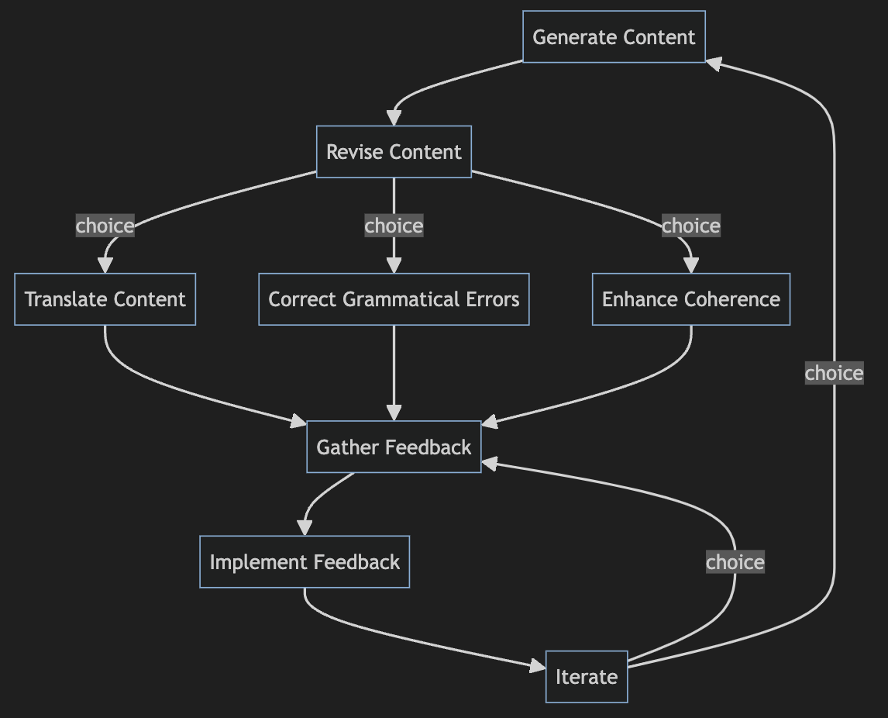

# GenAI Cards Flow

Let's define the model of genAI cards flow using the formal representation provided:

Let \( G = (V, E) \) be the directed graph representing the flow model, where:
- \( V \) is the set of nodes representing each card in the flow.
- \( E \) is the set of directed edges representing the transitions between cards.

Each node \( v_i \) in \( V \) represents a card, and each edge \( (v_i, v_j) \) in \( E \) represents the transition from card \( v_i \) to card \( v_j \).

Now, let's define the nodes (cards) and edges (transitions) based on the model of generative AI tasks:

Nodes (Cards):
1. Generate Content (Node 1)
2. Revise Content (Node 2)
3. Translate Content (Node 3)
4. Correct Grammatical Errors (Node 4)
5. Enhance Coherence (Node 5)
6. Improve Relevance (Node 6)
7. Adjust Tone (Node 7)
8. Gather Feedback (Node 8)
9. Implement Feedback (Node 9)
10. Iterate (Node 10)

The transitions between cards guide the flow of the generative content creation process, allowing for iterative refinement based on feedback and the completion of various tasks.
