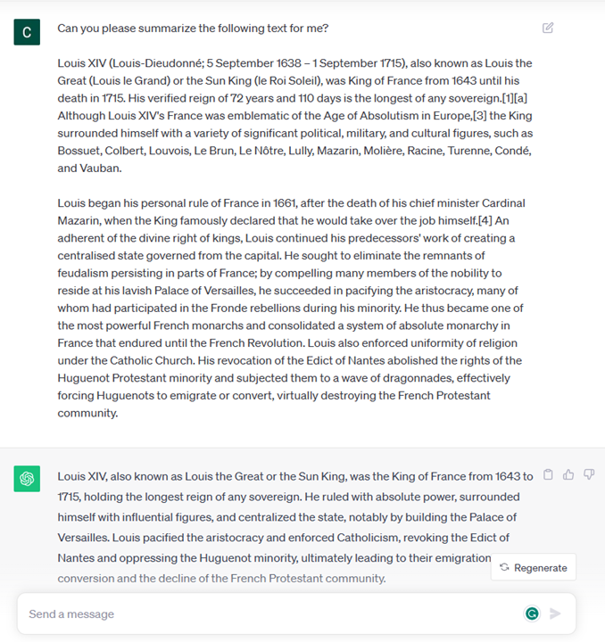
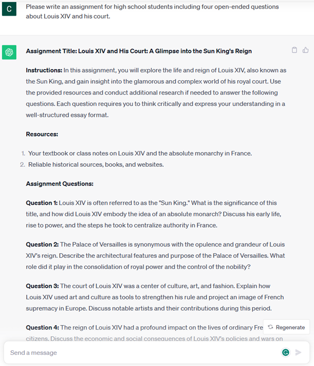
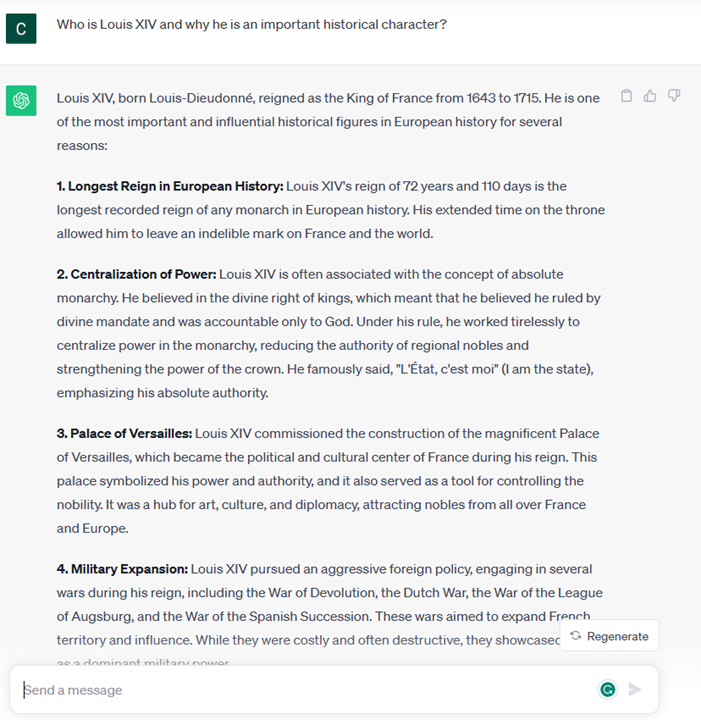
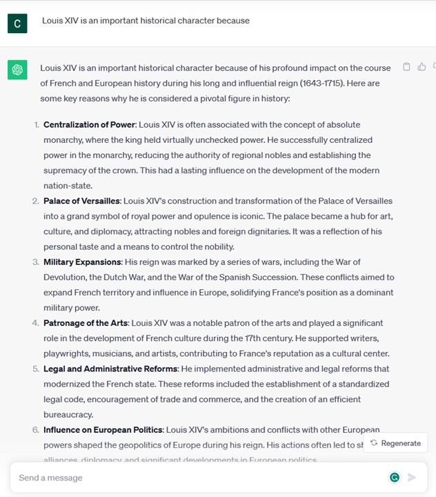
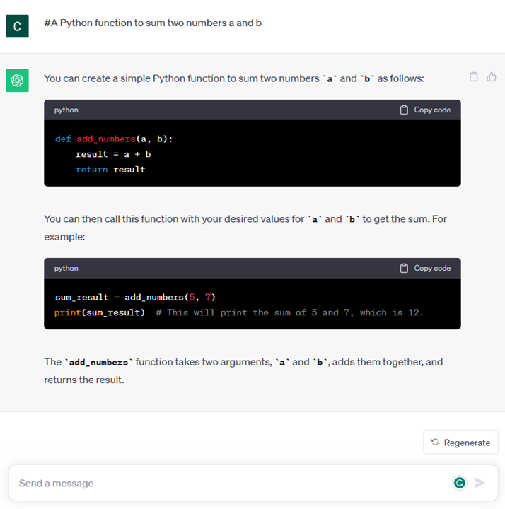

# Introduction to Generative AI and Large Language Models

### A statistical approach to AI: Machine Learning

A turning point arrived during the 90s, with the application of a statistical approach to text analysis. This led to the development of new algorithms – known with the name of machine learning - able to learn patterns from data, without being explicitly programmed. This approach allows a machine to simulate human language understanding: a statistical model is trained on text-label pairings, enabling the model to classify unknown input text with a pre-defined label representing the intention of the message.

### Neural networks and modern virtual assistants

In more recent times, the technological evolution of the hardware, capable of handling larger amounts of data and more complex computations, encouraged research in the AI fields, leading to the development of advanced machine learning algorithms – called neural networks or deep learning algorithms.

Neural networks (and in particular Recurrent Neural Networks – RNNs) significantly enhanced natural language processing, enabling the representation of the meaning of text in a more meaningful way, valuing the context of a word in a sentence.

This is the technology that powered the virtual assistants born in the first decade of the new century, very proficient in interpreting the human language, identifying a need, and performing an action to satisfy it – like answering with a pre-defined script or consuming a 3rd party service.

### Present day, Generative AI

So that’s how we came to Generative AI today, which can be seen as a subset of deep learning.

After decades of research in the AI field, a new model architecture – called *Transformer* – overcame the limits of RNNs, being able to get much longer sequences of text as input. Transformers are based on the attention mechanism, enabling the model to give different weights to the inputs it receives, ‘paying more attention’ where the most relevant information is concentrated, regardless of their order in the text sequence.

Most of the recent generative AI models – also known as Large Language Models (LLMs), since they work with textual inputs and outputs – are indeed based on this architecture. What’s interesting about these models – trained on a huge amount of unlabeled data from diverse sources like books, articles and websites – is that they can be adapted to a wide variety of tasks and generate grammatically correct text with a semblance of creativity. So, not only did they incredibly enhance the capacity of a machine to ‘understand’ an input text, but they enabled their capacity to generate an original response in human language.

## How do large language models work?

In the next chapter we are going to explore different types of Generative AI models, but for now let’s have a look at how large language models work, with a focus on OpenAI GPT (Generative Pre-trained Transformer) models.

* **Tokenizer, text to numbers**: Large Language Models receive a text as input and generate a text as output. However, being statistical models, they work much better with numbers than text sequences. That’s why every input to the model is processed by a tokenizer, before being used by the core model. A token is a chunk of text – consisting of a variable number of characters, so the tokenizer's main task is splitting the input into an array of tokens. Then, each token is mapped with a token index, which is the integer encoding of the original text chunk.

* **Predicting output tokens**: Given n tokens as input (with max n varying from one model to another), the model is able to predict one token as output. This token is then incorporated into the input of the next iteration, in an expanding window pattern, enabling a better user experience of getting one (or multiple) sentence as an answer. This explains why, if you ever played with ChatGPT, you might have noticed that sometimes it looks like it stops in the middle of a sentence.

* **Selection process, probability distribution**: The output token is chosen by the model according to its probability of occurring after the current text sequence. This is because the model predicts a probability distribution over all possible ‘next tokens’, calculated based on its training. However, not always the token with the highest probability is chosen from the resulting distribution. A degree of randomness is added to this choice, in a way that the model acts in a non-deterministic fashion - we do not get the exact same output for the same input. This degree of randomness is added to simulate the process of creative thinking and it can be tuned using a model parameter called temperature.

## How can our startup leverage Large Language Models?

Now that we have a better understanding of the inner working of a large language model, let’s see some practical examples of the most common tasks they can perform pretty well, with an eye to our business scenario.
We said that the main capability of a Large Language Model is *generating a text from scratch, starting from a textual input, written in natural language*.

But what kind of textual input and output?
The input of a large language model is known as prompt, while the output is known as completion, term that refers to the model mechanism of generating the next token to complete the current input. We are going to dive deep into what is a prompt and how to design it in a way to get the most out of our model. But for now, let’s just say that a prompt may include:

* An **instruction** specifying the type of output we expect from the model. This instruction sometimes might embed some examples or some additional data.

    1. Summarization of an article, book, product reviews and more, along with extraction of insights from unstructured data.
    
    

    
    2. Creative ideation and design of an article, an essay, an assignment or more.
    
    

 
    
* A **question**, asked in the form of a conversation with an agent.
  

* A chunk of **text to complete**, which implicitly is an ask for writing assistance.
   

* A chunk of **code** together with the ask of explaining and documenting it, or a comment asking to generate a piece of code performing a specific task.

The examples above are quite simple and don’t want to be an exhaustive demonstration of Large Language Models capabilities. They just want to show the potential of using generative AI, in particular but not limited to educational context.

Also, the output of a generative AI model is not perfect and sometimes the creativity of the model can work against it, resulting in an output which is a combination of words that the human user can interpret as a mystification of reality, or it can be offensive. Generative AI is not intelligent - at least in the more comprehensive definition of intelligence, including critical and creative reasoning or emotional intelligence; it is not deterministic, and it is not trustworthy, since fabrications, such as erroneous references, content, and statements, may be combined with correct information, and presented in a persuasive and confident manner. In the following lessons, we’ll be dealing with all these limitations and we’ll see what we can do to mitigate them.

